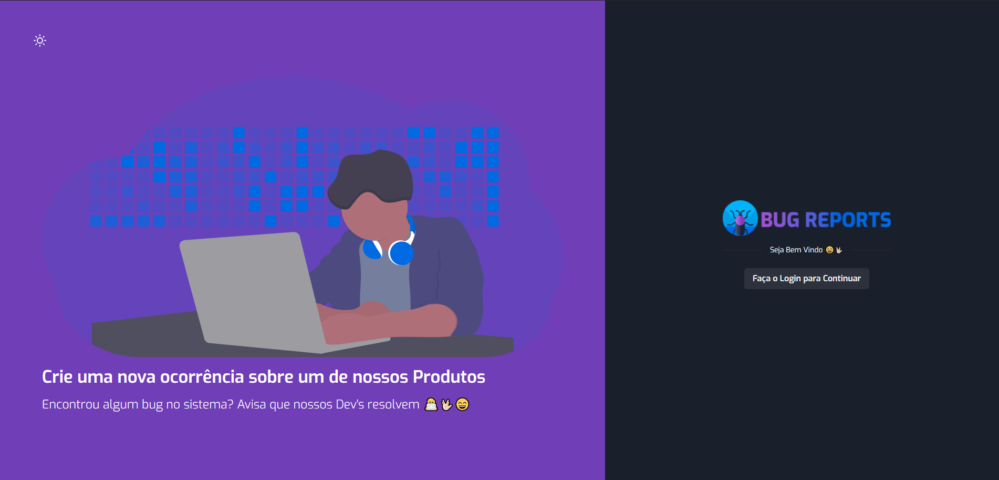
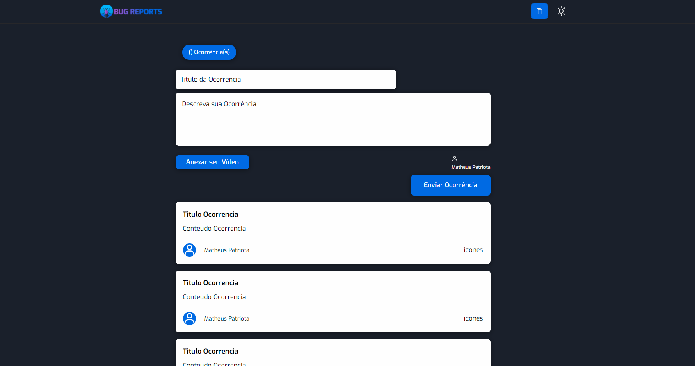

<p align="center">
  
</p>


<h1 align="center">
    
</h1>
<h1 align="center">
    
</h1>

<br>


## 🧑🏼‍💻 Projeto Prototipado com o Figma
<a href="https://www.figma.com/file/4S87TK0lfzorscyX6GiRKp/Projeto-FInal-Desenvolvimento-Web">Link do Projeto no Figma</a>

## 🧪 Tecnologias

Esse projeto foi desenvolvido com as seguintes tecnologias:
- [NextJS](https://nextjs.org/)
- [React](https://reactjs.org)
- [Styled Components](https://styled-components.com/)
- [Firebase](https://firebase.google.com/)
- [TypeScript](https://www.typescriptlang.org/)

## 🚀 Como executar

Clone o projeto e acesse a pasta do mesmo.

```bash
$ git clone https://github.com/MatheusPatriota/BugReports.git
$ cd BugReports
```

Para iniciá-lo, siga os passos abaixo:
```bash
# Instalar as dependências
$ yarn

# Iniciar o projeto
$ yarn start
```
O app estará disponível no seu browser pelo endereço http://localhost:3000.

Lembrando que será necessário criar uma conta no [Firebase](https://firebase.google.com/) e um projeto para disponibilizar um Realtime Database caso queira editar o projeto.

## 💻 Projeto

BugReports é perfeito para empresas que querem ter controle sobre ocorrências bugs em seus
produtos, classificando eles por ordem de entrada, os estados da aplicação são: "Recebido","Em análise" e "Concluído".


Este é um projeto desenvolvido como estudo das tecnologias citadas acima.

#### 🚀 O mundo é gigantesco e estamos apenas na linha de partida.